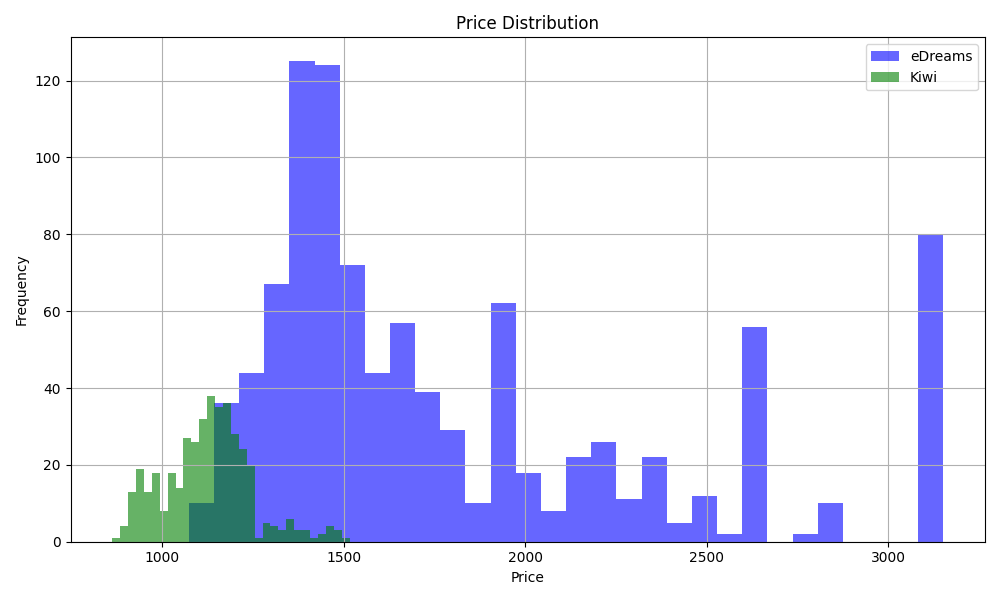
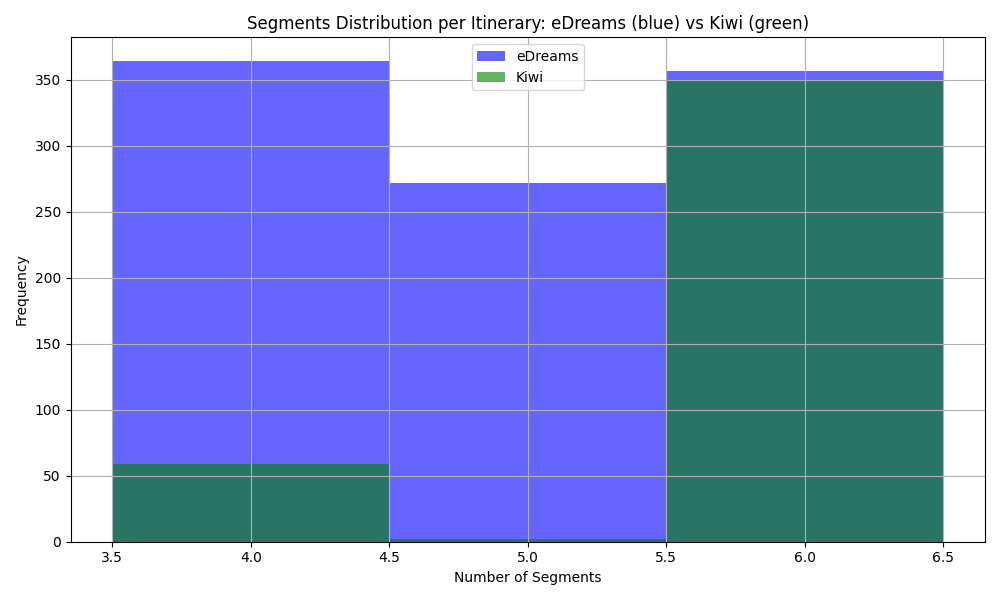
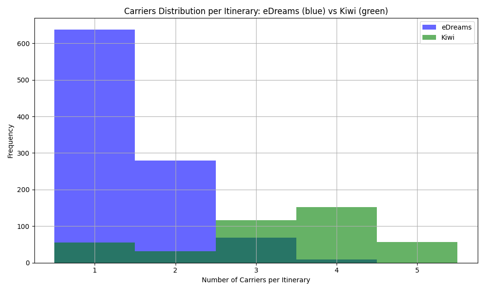
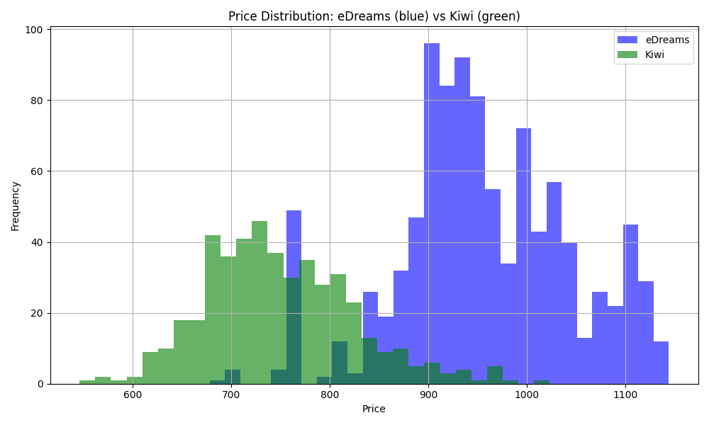
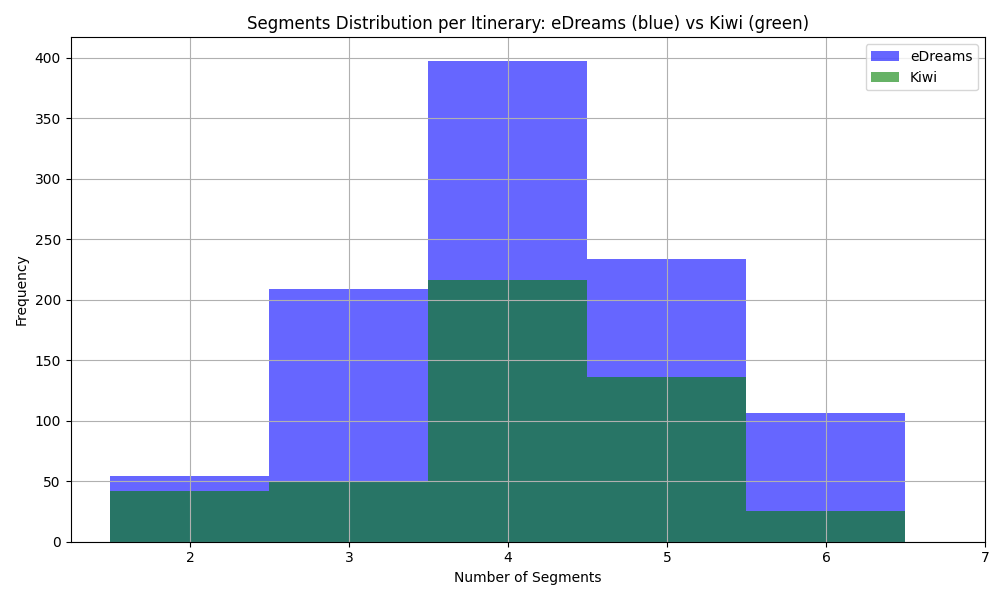
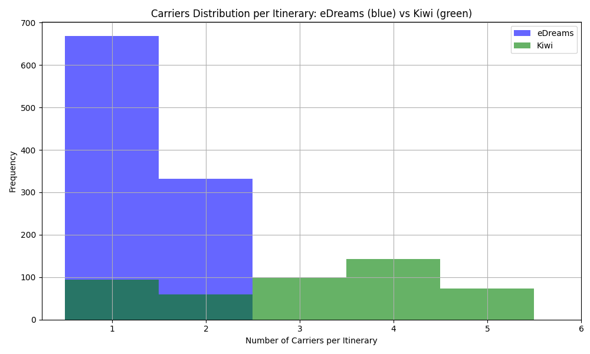

# eDO Opportunity Analysis

This document provides key conclusions and opportunities for eDreams (eDO) based on a comparative analysis of itinerary offerings and pricing for two journeys: **BCN-DPS RT** and **MAD-NYC RT**.

---

## 1. Inventory Coverage and Overlap

### MAD-NYC RT
- **Total Kiwi itineraries:** 241  
- **Total eDreams itineraries:** 1,000  
- **Repeated itineraries:** 28  
- **Missing in eDreams:** 213  
- **Missing in Kiwi:** 972  
- **Cheapest eDreams price:** €677.97  
- **Cheapest Kiwi price:** €546.0  
- **Kiwi itineraries cheaper than cheapest eDreams:** 69  

### BCN-DPS RT
- **Total Kiwi itineraries:** 410  
- **Total eDreams itineraries:** 816  
- **Repeated itineraries:** 41  
- **Missing in eDreams:** 369  
- **Missing in Kiwi:** 775  
- **Cheapest eDreams price:** €1072.85  
- **Cheapest Kiwi price:** €862.0  
- **Kiwi itineraries cheaper than cheapest eDreams:** 125  

**Observations:**  
- For MAD-NYC RT, out of 241 Kiwi itineraries, there are 69 itineraries priced lower than the cheapest eDreams option.  
- For BCN-DPS RT, 125 Kiwi itineraries are cheaper than the cheapest option offered by eDreams.  
- These numbers indicate that Kiwi consistently provides a significant number of lower-priced itineraries that eDreams does not offer.

---

## 2. Price Competitiveness

- **MAD-NYC RT:**  
  - *Cheapest eDreams price:* €677.97  
  - *Cheapest Kiwi price:* €546.0  
- **BCN-DPS RT:**  
  - *Cheapest eDreams price:* €1072.85  
  - *Cheapest Kiwi price:* €862.0  

**Implication:** eDreams is at a pricing disadvantage in both journeys, with a considerable number of Kiwi itineraries (69 for MAD-NYC RT and 125 for BCN-DPS RT) being cheaper.

---

## 3. Market Positioning and Customer Acquisition

- **Value Proposition Enhancement:**  
  - eDreams offers a broader inventory, but the significant number of lower-priced Kiwi itineraries (69 for MAD-NYC RT and 125 for BCN-DPS RT) suggests eDreams is missing an opportunity to attract budget-conscious travelers.
- **Targeted Marketing & Supplier Strategy:**  
  - Focusing on enhancing lower-priced offerings or negotiating better rates could help eDreams capture a larger share of the market.
  - Emphasizing additional value (e.g., better customer service, travel conditions, or loyalty benefits) may help justify the higher fares.

---

## 4. Graphs and Conclusions

For each journey, we generated three separate graphs that show:
- **Price Distribution:** The distribution of prices (blue for eDreams, green for Kiwi).
- **Segments Distribution:** The distribution of the number of segments per itinerary.
- **Carriers Distribution:** The distribution of the number of carriers per itinerary.

### BCN-DPS RT (DPS case)
- **Price Distribution**  
  
- **Segments Distribution**  
  
- **Carriers Distribution**  
  

**Graph Conclusions for BCN-DPS RT:**
- **Price:** eDreams (blue) consistently shows higher prices compared to Kiwi (green).
- **Segments:** The segments distribution reveals that for DPS, eDO offers significantly more convenient content with a strong peak at 4 segments. This indicates that eDO is favoring itineraries with fewer segments, which can be seen as more convenient.
- **Carriers:** eDreams itineraries include up to 2 carriers, while Kiwi itineraries tend to involve more carriers.

### MAD-NYC RT (NYC case)
- **Price Distribution**  
  
- **Segments Distribution**  
  
- **Carriers Distribution**  
  

**Graph Conclusions for MAD-NYC RT:**
- **Price:** The price distribution confirms that eDreams (blue) has higher pricing compared to Kiwi (green).
- **Segments:** The segments distribution for NYC shows no significant difference between the two OTAs, indicating similar itinerary structures in terms of flight connections.
- **Carriers:** Kiwi itineraries typically include more than 3 carriers, whereas eDreams itineraries involve fewer carriers.

---

## Final Conclusions

- **Inventory Gaps:**  
  - eDreams is missing a number of lower-priced itineraries that Kiwi offers—69 for MAD-NYC RT and 125 for BCN-DPS RT—indicating an opportunity to better capture the budget market.
  
- **Price Competitiveness:**  
  - eDreams is at a disadvantage in pricing for both journeys. The significant number of lower-priced Kiwi itineraries (69 for MAD-NYC RT and 125 for BCN-DPS RT) suggests that many price-sensitive customers might prefer Kiwi.

- **Segments Structure:**  
  - For the DPS journey, eDO stands out by offering a strong peak at 4 segments, indicating more convenient flight options.  
  - For the NYC journey, both OTAs offer similar itinerary structures.

- **Carriers Distribution:**  
  - Kiwi tends to include more carriers per itinerary compared to eDreams. In the DPS case, eDreams itineraries are limited to up to 2 carriers, while in the NYC case, most Kiwi itineraries involve more than 3 carriers.

- **Strategic Opportunity:**  
  - eDreams should consider negotiating better rates or implementing dynamic pricing strategies to improve competitiveness.
  - Enhancing the value proposition through better service or travel conditions may help justify the higher prices.

By addressing these opportunities, eDreams can refine its strategy to capture a broader market share and better serve price-sensitive travelers.